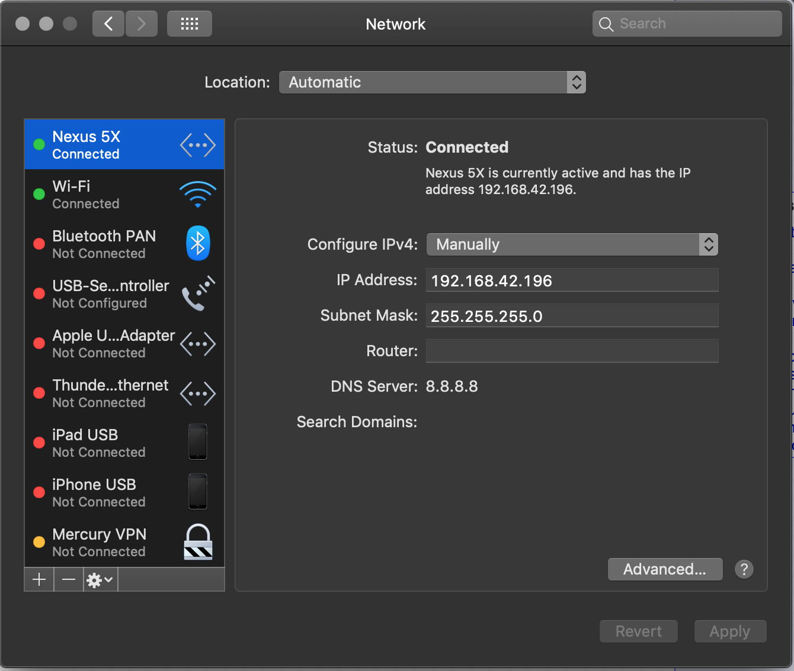

# deadeye-comm-sim

Test communication protocol between Android phone used for vision system and host. The networking is TCP/IP over an USB tether via RNDIS. Tested with [HoRNDIS](https://joshuawise.com/horndis) on macOS.

## USB Network Configuration


## Example

```
➜ ./gradlew installDist
➜ ./build/install/comm-demo/bin/comm-demo
Starting pings to 192.168.42.129:5555 at 100 ms interval.
Listening for pongs on port 5555 with limit 400 ms.
DISCONNECTED
12/13/18 12:05:48 PM ===========================================================

-- Histograms ------------------------------------------------------------------
Latency (ms)
             count = 0
               min = 0
               max = 0
              mean = 0.00
            stddev = 0.00
            median = 0.00
              75% <= 0.00
              95% <= 0.00
              98% <= 0.00
              99% <= 0.00
            99.9% <= 0.00

-- Meters ----------------------------------------------------------------------
FPS
             count = 0
         mean rate = 0.00 events/second
     1-minute rate = 0.00 events/second
     5-minute rate = 0.00 events/second
    15-minute rate = 0.00 events/second


CONNECTED
12/13/18 12:05:58 PM ===========================================================

-- Histograms ------------------------------------------------------------------
Latency (ms)
             count = 189
               min = 0
               max = 34
              mean = 13.54
            stddev = 6.47
            median = 10.00
              75% <= 18.00
              95% <= 27.00
              98% <= 32.00
              99% <= 34.00
            99.9% <= 34.00

-- Meters ----------------------------------------------------------------------
FPS
             count = 189
         mean rate = 9.33 events/second
     1-minute rate = 2.85 events/second
     5-minute rate = 0.60 events/second
    15-minute rate = 0.20 events/second
```